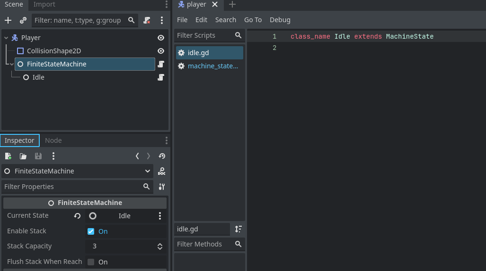
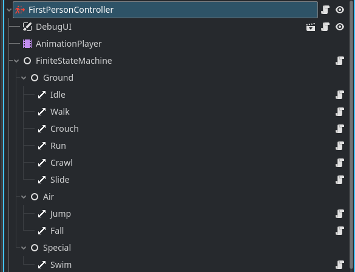

<div align="center">
	

<h3 align="center">Indie Blueprint State Machine</h3>

  <p align="center">
   Finite state machines (FSMs) empower you to create intricate behaviors in a modular way. Each state can be defined independently, allowing for data sharing, state transitions, and more
	<br />
	·
	<a href="https://github.com/ninetailsrabbit/indie-blueprint-state-machine/issues/new?assignees=ninetailsrabbit&labels=%F0%9F%90%9B+bug&projects=&template=bug_report.md&title=">Report Bug</a>
	·
	<a href="https://github.com/ninetailsrabbit/indie-blueprint-state-machine/issues/new?assignees=ninetailsrabbit&labels=%E2%AD%90+feature&projects=&template=feature_request.md&title=">Request Features</a>
  </p>
</div>

<br>
<br>

---

- [📦 Installation](#-installation)
- [Finite State Machine 🔁](#finite-state-machine-)
- [Structure of a MachineState](#structure-of-a-machinestate)
- [📚 Getting started](#-getting-started)
  - [Accessible properties from FiniteStateMachine](#accessible-properties-from-finitestatemachine)
  - [Signals available](#signals-available)
  - [Recipe to add a new finite state machine](#recipe-to-add-a-new-finite-state-machine)
  - [Change to another state](#change-to-another-state)
  - [Creating transitions between states](#creating-transitions-between-states)
    - [Register a new transition](#register-a-new-transition)
- [🔒 Lock or Unlock](#-lock-or-unlock)

---

# 📦 Installation

1. [Download Latest Release](https://github.com/ninetailsrabbit/indie-blueprint-state-machine/releases/latest)
2. Unpack the `addons/ninetailsrabbit.fsm` folder into your `/addons` folder within the Godot project
3. Enable this addon within the Godot settings: `Project > Project Settings > Plugins`

To better understand what branch to choose from for which Godot version, please refer to this table:
|Godot Version|FSM Branch|FSM Version|
|---|---|--|
|[](https://godotengine.org/)|`main`|`1.x`|

# Finite State Machine 🔁

Finite state machines (FSMs) empower you to create intricate behaviors in a modular way. Each state can be defined independently, allowing for data sharing, state transitions, and more.

As an essential tool in game development, mastering FSMs will give you a significant edge.

---

**Features:**

- **Conditional Transitions:** Define conditions that determine when a state changes. You can also execute background behaviors during transitions.
- **State History Tracking (Optional):** Maintain a stack of previous states, providing valuable context for complex behaviors.
- **Node-Based Structure:** Aligned with Godot's philosophy, states are added in a hierarchical node structure.
- **State Machine Locking:** Lock or unlock the state machine as needed to control its behavior.

---

# Structure of a MachineState

States are designed to be extensible, allowing you to override specific behaviors. Each state has access to its parent finite state machine, facilitating communication and data sharing.

```swift
class_name MachineState extends Node

// This signals are emitted automatically when the FSM change states
signal entered
signal finished(next_state)

var FSM: FiniteStateMachine

// This functions only executes once when the state it's ready on the finite state machine. This is the place
// where the FSM also it's initialized.
func ready() -> void:
	pass

// This function executes when the state enters as current state
func _enter() -> void:
	pass


// This function executes when the state exits from being the current state and transitions to the next one.
func _exit(_next_state: MachineState) -> void:
	pass

// In case you want to customize how this state handle the inputs in your game this is the place to do that.
func handle_input(_event: InputEvent):
	pass

// This function executes on each frame of the finite state machine's physic process
func physics_update(_delta: float):
	pass

// This function executes on each frame of the finite state machine's process
func update(_delta: float):
	pass
```

# 📚 Getting started

## Accessible properties from FiniteStateMachine

```swift
@export var current_state: MachineState
@export var enable_stack: bool = true
@export var stack_capacity: int = 3
@export var flush_stack_when_reach_capacity: bool = false


// The current states in the form of Dictionary[string, MachineState]
// {"Idle": Idle}
var states: Dictionary = {}

// The transitions setup for this state machine in the form of Dictionary[string, MachineTransition]
// {"IdleToWalkTransition", IdleToWalkTransition}
var transitions: Dictionary = {}

var states_stack: Array[MachineState] = [] // The history of previous states this machine has been through
var is_transitioning: bool = false // If the machine it's currently transitioning to another state (mostly used internaly)
var locked: bool = false // If the machine it's locked so no state changes can be done
```

## Signals available

```swift
// When all the states from the node are initialized
signal states_initialized(states: Dictionary)

// When current state it's changed to a new one
signal state_changed(from_state: MachineState, state: MachineState)

// If the state change failed for a reason
signal state_change_failed(from: MachineState, to: MachineState)

// If a new state joins the history stack
signal stack_pushed(new_state: MachineState, stack: Array[MachineState])

// If the history stack it's flushed and has remained empty
signal stack_flushed(stack: Array[MachineState])
```

## Recipe to add a new finite state machine

1. Add the finite state machine to the scene tree
2. Create an initial state that extends from `MachineState`
3. Add a new state node to the tree as a child
4. Set an initial state for the `FSM` in the exported variable
5. Enable or disable the `stack` which maintains the history of previous states

---


---



---

As you can see in the next image, the state nodes can can be anywhere on the tree without having to be a direct child. This allows you to create a better visualisation of the nodes:



## Change to another state

The `FSM` node that can be accesed from any state allows you to do the more important feature on a finite state machine, **change to a new state**

```swift
// Use the state name
FSM.change_state_to("Walk")

// Or use the state class
FSM.change_state_to(Walk)

// Pass parameters as dictionary to the new state transition
FSM.change_state_to(Walk, {"speed_boost": 1.5})

```

```swift
class_name Idle extends MachineState

@export var player: CharacterBody2D


func physics_update(delta):

	if not actor.input_direction.is_zero_approx():
		FSM.change_state_to(Walk) // Or FSM.change_state_to("Walk")

```

## Creating transitions between states

This `FSM` allows you to create transitions that will be applied between states and can decide if the transition is done or not. This is the way where the parameters are obtained and passed on to the states as properties.

**⚠️ States as such do not have access to the parameter dictionary**, instead, it is better to use them in the transition and assign them as expected properties to these states.

```swift
class_name MachineTransition

var from_state: MachineState
var to_state: MachineState

var parameters: Dictionary = {}


func should_transition() -> bool:
	return true

func on_transition():
	pass
```

### Register a new transition

For the machine to be aware of them, **these transitions need to be recorded**. The transition class needs to have the name in the form of `{FromState}To{NewState}Transition`.

**If you need to apply a transition every time** you change to a specific state you can use the word `Any`, `AnyTo{NewState}Transition`

This is how it is done:

```swift
// Create a new custom transition for your use case

class_name WalkToRunTransition extends MachineTransition

func should_transition() -> bool:
	if from_state is Walk and to_state is Run:
		return from_state.actor.run and from_state.catching_breath_timer.is_stopped()

	return false


// Register the transition in the script or scene you have access the state machine
class_name FirstPersonController extends CharacterBody3D

@onready var finite_state_machine: FiniteStateMachine = $FiniteStateMachine

// ...

func _ready() -> void:
	// ...

	finite_state_machine.register_transition(WalkToRunTransition.new())
	// Or you can register multiple transitions at once
	finite_state_machine.register_transitions([
		WalkToRunTransition.new(),
		RunToWalkTransition.new()
		AnyToJumpTransition.new()
	])

```

# 🔒 Lock or Unlock

The machine can be locked, useful when when you have a manageable character and you don't want him/her to change state when there is a cinematic or interacting with objects.

```swift
FSM.lock_state_machine()
FSM.unlock_state_machine()
```
